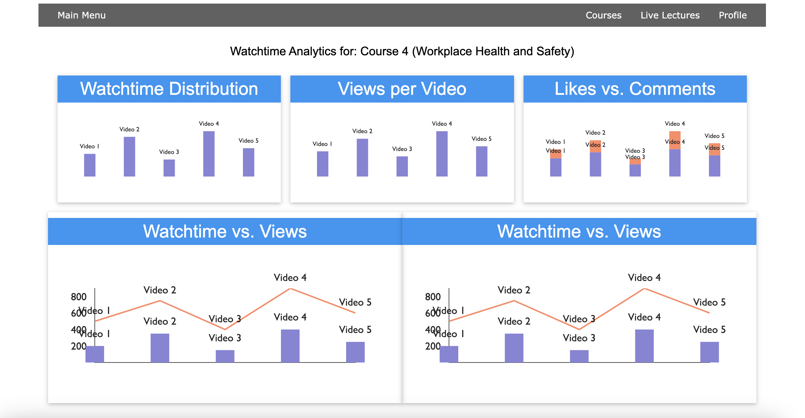

# Online Learning Platform

This is a online streaming and video library platform for educational purposes. It is built using React, .NET C# ,MySQL, Agora.io, AWS.

## Screenshots

Here are some screenshots from the project:

- 404 Page
  

- Courses Page
  

- Lecture Page
  

- Login Form
  

- Prejoin Screen
  

- Analytics Page
  

- Join Page
  

- Login Page
  

- Prejoin Screen
  
